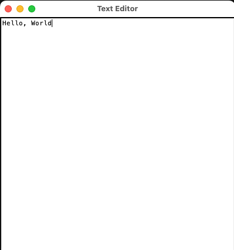

# Text Editor

[](https://github.com/orsenthil/first-texteditor/actions/workflows/python-tests.yml)
[](https://codecov.io/gh/orsenthil/first-texteditor)

A very simple text editor written in Python with tkinter module.

## Installation

```bash
git clone https://github.com/USERNAME/texteditor.git
cd texteditor
```

## Usage

```bash
python main.py
```




## Testing

```bash
python -m unittest test_main.py -v
test_init (test_main.TestTextEditor.test_init)
Test initialization of the TextEditor. ... ok
test_new_file (test_main.TestTextEditor.test_new_file)
Test creating a new file. ... ok
test_open_file_cancelled (test_main.TestTextEditor.test_open_file_cancelled)
Test behavior when user cancels file open dialog. ... ok
test_open_file_error (test_main.TestTextEditor.test_open_file_error)
Test error handling when opening a file fails. ... ok
test_open_file_success (test_main.TestTextEditor.test_open_file_success)
Test opening a file successfully. ... ok
test_save_as_cancelled (test_main.TestTextEditor.test_save_as_cancelled)
Test save_as functionality when user cancels the dialog. ... ok
test_save_as_success (test_main.TestTextEditor.test_save_as_success)
Test save_as functionality when file dialog returns a file. ... ok
test_save_file_error (test_main.TestTextEditor.test_save_file_error)
Test error handling when saving fails. ... ok
test_save_file_existing (test_main.TestTextEditor.test_save_file_existing)
Test saving an existing file. ... ok
test_save_file_new (test_main.TestTextEditor.test_save_file_new)
Test saving a new file (should call save_as). ... ok

----------------------------------------------------------------------
Ran 10 tests in 0.765s

OK
```

## Credits

* https://www.youtube.com/watch?v=xqDonHEYPgA
* Cursor Editor and Anthropic Claude

## Author

Senthil Kumaran